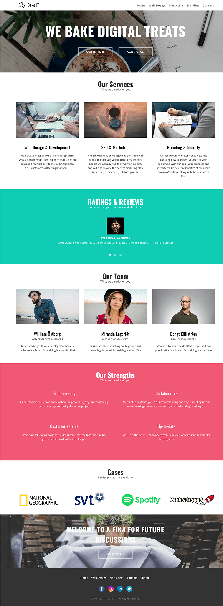

# BakeIT
Brandon Tsegai, Cecilia Karlsson & Tommy Kärnström 
Repostory [link](https://github.com/tomkaar/BakeIT) 
Github Pages [Link]() 
Trello [Link](https://trello.com/b/I8tPOZPr/bakeit)

## Om Bake IT
Med mål om att ta ett klassiskt svenskt koncept utomlands - fika - och få in mer personlighet i vårt arbetssätt istället för det hårda rakt-på men ändå behålla ett professionellt beteende. Vårt mål är att hjälpa existerande företag - stora och små - att modernisera eller ändra företagets image och hemsida.  
Välkommen in på en fika!  

## Arbetsmetod
Vi har använt trello för att hålla koll på kommande, pågående samt klara arbetsuppgifter - på detta vis har alla alltid haft koll på vad som händer i projektet. Med stort fokus på kommunikation mellan medlemmarna har arbetet gått framåt i stadig takt. 

Med uppdelning utav undersidor att göra hade alla något att göra, en sida var. Tillsammans gjorde vi en bas med variabler, mixins och färdiggjorda moduler så det var enkelt att skapa sina egna sidor och få sidorna att se likadana ut.  

Vi försökte att spendera så mycket tid i klassrummet som möjligt, varje gång vi gjorde någon större ändring som påverkade varandras sidor så var vi noga med att säga till varandra och pusha till github för att undvika merge konflikter så mycket som möjligt.

## Mockup vs Verklighet
Vi var väldigt nöjda med hur resultatet på vår mock-up såg ut, och valde att inte implementera många ändringar på vår slutgiltiga produkt, utan utgick från vår färdiga mock-up till stor grad. Samtliga ändringar vi gjorde gjordes genom konsensus och en väluttänkt anledning.

## Sammanfattning
Med god kommunikation och stor tid som spenderades att koda sida vid sida finns det många lärdomar att hämta ifrån vårt arbete. Genom att alla medlemmar var med i samtliga delar av sidans uppbyggnad lämnade det oss med stor frihet att självständigt göra ändringar vart det än krävdes i källkoden.  

Tydligt strukturerad kod bidrog till att problemlösning blev enklare, då det lämnade oss med många verktyg att använda. Genom att ha tillgång till samma variabler och mixins är vår sida även lätt att underhålla då samtliga delar av den använder sig av samma styling, vilket innebär att man kan göra många ändringar på sidan med endast några få ändringar i den slutgiltiga CSS-koden. 

Vi var även väldigt konsekventa med att ses och arbeta på projektet utan att låta alltför lång tid gå emellan våra gruppsessioner, och på så vis effektivisera tiden man jobbade på egen hand, då man inte behövde oroa sig för att alltför många ändringar ska ha gjorts utan ens kännedom.

## IE8 Screenshot

### Krav
- [x] Mobile First
- [x] Responsive
- [x] SASS
- [x] Semantisk html
- [x] Flexbox
- [x] Meny
- [x] Mobil Webbläsare
- [x] Relativa måttenheter
- [x] Korrekt indentering
- [x] IE8
- [ ] Tillgänglighetsanpassad
- [ ] GitHub Pages
